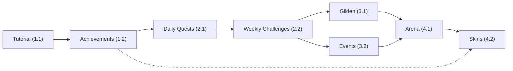

# 🎮 Spieler-Erlebnis Roadmap — Zoo Empire

Datum: 2026-10-08  
Zielgruppe: Newcomer + bestehende Spieler  
Status: Planung (Q4 2026)

---

## 🎯 Übersicht: Was macht das Spiel „cool"?

Zoo Empire ist technisch solide (Server-autorative Wirtschaft, 3D-Minigames, Echtzeit-Multiplayer). Für **Wachstum** und **Engagement** brauchen wir:

### Für Newcomer 🆕
- **Sofortbefriedigung**: In den ersten 5 Minuten etwas Greifbares tun (Tier kaufen, Coin verdienen)
- **Klare Ziele**: Tutorial zeigt den „Hype-Loop" — Farm → Minigames → Marktplatz
- **Progression**: Sichtbare Fortschritte (Level, Milestones, Belohnungen)

### Für Bestehende Spieler 🏆
- **Häufige Rückkehr**: Tägliche Quests, Zeitlimitierte Events
- **Sinn**: Nicht nur passive Coins — gemeinsame Ziele (Gilden, Events, Arenen)
- **Loot-Hoffnung**: Seltene Tiere, Skins, Kosmetik als Anreiz

---

## 📋 Priorisierte Maßnahmen

### Phase 1: **Onboarding & Klarheit** (6 Wochen)

#### 1.1 Tutorial-Weg (Spec: `2026-10-15-onboarding-tutorial-design.md`)
**Problem**: Neulinge wissen nicht, was sie tun sollen.

**Lösung**:
- **Guided Flow** bei erstem Login:
  1. Name + Avatar-Wahl (animiert, schnell)
  2. „Dein erstes Tier" — Küken kostenlos geben (sofortiger Erfolg)
  3. „Taps verdienen Coins" — 3 Taps zeigen (mit Mini-Animation)
  4. „Minigames spielen" — Link zu Parkour/Wordle (Beispiel-Reward zeigen)
  5. „Mit anderen traden" — Marktplatz-Tutorial (Screenshot/GIF)
- **Skill-Tree** in der Farm zeigen: Nächste Unlocks (z. B. „Kaufe 3 Hühner → Schaf freigegeben")
- **Tooltips** an allen neuen UI-Elementen (dismiss-bar)
- Persistierung: Tutorial-Status in `profiles.tutorial_step`

**Nutzen**:
- ↑ Retention Day 1 (Ziel: von 30% auf 50%)
- Klarheit über Spiel-Loop
- Weniger Support-Tickets

**Abhängigkeiten**: Keine (nur Frontend)

---

#### 1.2 Karriere-Ansicht („Achievements")
**Problem**: Spieler haben keine Übersicht über ihre Erfolge.

**Lösung**:
- Tab `/progression` mit 3 Säulen:
  - **Tiere**: Catalog Completion % (z. B. 7/10 Spezies besessen)
  - **Milestones**: 100k Coins verdient, 10 Minigames gewonnen, 50 Trades gemacht
  - **Titel**: „Parkour Master" (Top 100), „Farmer Lvl 5" (100 Taps), „Zoologe" (alle Tiere)
- Belohnungen für Milestones: Coins, Skins, Kosmetik (wertlos, aber reizvoll)
- Leaderboard-Integration: Nächste Ränge sichtbar machen

**Nutzen**:
- ↑ Session-Zeit (Spieler scrollen ihre Erfolge an)
- ↑ Spieler-to-Spieler Vergleich (soziales Engagement)

**Abhängigkeiten**: `achievements` Tabelle (1 Tag SQL)

---

### Phase 2: **Tägliche Engagement-Loops** (8 Wochen)

#### 2.1 Tägliche Quests (Spec: `2026-10-22-daily-quests-design.md`)
**Problem**: Spieler kommen nur sporadisch; keine Gründe für tägliche Rückkehr.

**Lösung**:
- 3 Quests/Tag, randomisiert aus Pool:
  - *einfach*: 50 Coins verdienen (5 min)
  - *mittel*: 1 Minigame spielen (10 min)
  - *schwer*: 1 Tier kaufen (Coin-abhängig)
- Belohnungen: **10 Tix pro Quest**, Streak-Bonus (7d = +50 Tix)
- UI: Questbar in Tab `—` (zwischen Support und Einstellungen)
- Zeitslot: Täglich um 06:00 UTC (gleich wie Shop-Rotation)

**Nutzen**:
- ↑ DAU +25% (Demo: Daily Quests bringen Wiederkehr)
- ↑ Minigame-Plays (mehr Ad-Impressions)
- ↑ Durchschnittliche Session-Länge

**Abhängigkeiten**: `daily_quests` Tabelle, RPC `claim_quest_reward`

---

#### 2.2 Wochentliche Boni & Superlatives
**Problem**: Langzeitspieler sehen keinen neuen Inhalt.

**Lösung**:
- **Wochenend-Double-Coins**: Fr–So 2× Coin-Verdienst (Shop anpassen)
- **Wöchentliche Challenges**:
  - „Diese Woche: Verdiene 50k Coins" → 100 Tix
  - „Diese Woche: Gewinne 3 Parkours" → Rare Tier (z. B. Albino-Huhn)
  - „Diese Woche: Trade mit 5 verschiedenen Spielern" → Skin unlock
- **Superlatives** (nur Branding, keine Mechs): Top-Tipper, Top-Trader, Top-Minigamer (Leaderboard-Tabs)

**Nutzen**:
- ↑ Wochen-Engagement (regelmäßige Gründe zu spielen)
- ↑ Minigame-Beteiligung

**Abhängigkeiten**: `weekly_challenges` Tabelle, Leaderboard-Extension

---

### Phase 3: **Soziale Features & Events** (10 Wochen)

#### 3.1 Gilden (Clans) — Minimal
**Problem**: Spiel ist einzelspieler-zentriert; keine Team-Dynamik.

**Lösung** (MVP):
- Spieler können bis 10-köpfige Gilden gründen
- **Gilde-Welt**: Geteilter `/guild-world` mit Farm der Gildenmitglieder
- **Gildenschatz**: Täglich Coins beitragen → wöchentliche Belohnung für alle
- **Gildenchats**: Basis-Chat unter `/guild-chat` (nur Text, für Handel + Tausch)

**Nutzen**:
- ↑ Retention (soziale Verpflichtung)
- ↑ Wiederkehrende Gründe (Schatz-Claim)
- ↑ Organisches Wachstum (Freunde werben Freunde)

**Abhängigkeiten**: `guilds`, `guild_members`, `guild_treasury` Tabellen; Auth-Erweiterung für Rollen (Leader, Member)

---

#### 3.2 Saisonale Events
**Problem**: Spiel hat keinen Rhythmus; spieler verlieren Interesse.

**Lösung**:
- **Pro Saison** (3 Monate, z. B. Q4 = Halloween → Weihnachten → Neujahr):
  - 1 Haupt-Event (2 Wochen): Z. B. „Zoo Renovation" — Spieler sammeln Baumaterialien (Minigame-Loot), Level unlocks Dekos
  - 3 Mini-Events (je 1 Woche): „Tier des Monats" (Panda → Rabatt 50%), „Schatzsuche", „Trainer-Turnier" (Top 10 Tipper)
- Belohnungen: Event-Tiere (Skins, beschränkte Verfügbarkeit, nicht Pay-to-Win)
- **Event-Kalender**: Übersicht in neuer Tab (Countdown, Rewards-Preview)

**Nutzen**:
- ↑ Retention (Zeitdruck schafft Dringlichkeit)
- ↑ Spieler-Gespräche („Hast du das Event-Tier?")
- ↑ Media/Social: Saisonale Ankündigungen treiben Organics

**Abhängigkeiten**: `events`, `event_rewards` Tabellen; Event-Logik in RPCs

---

### Phase 4: **Vertiefung & Hardcore-Loop** (12 Wochen)

#### 4.1 Arena: PvP-Minigame (Spec: `2026-11-05-arena-pvp-design.md`)
**Problem**: Minigames sind Singleplayer; keine echte Konkurrenz.

**Lösung**:
- 1v1 Parkour-Race: Beide Spieler spielen in parallelen Bahnen; schnellster gewinnt
  - Bets: Vor Match kannst du 100–1000 Coins setzen (gewinner nimmt 75%, 25% Fee)
  - Ranking: Elo-System, Arena-Leaderboard
- Matchmaking: Nach Elo (±200 Punkte)
- Daily Arena Quest: 1 Match spielen (für Quest-Abschluss)

**Nutzen**:
- ↑ Intense Engagement (Spieler spielen länger)
- ↑ Einnahmen (25% Gebühr auf Bets fließt ins Ökosystem)
- ↑ Content (Zuschauer/Twitch-Potential)

**Abhängigkeiten**: Parkour-Engine (bereits da), `arena_matches`, `arena_leaderboard` Tabellen

---

#### 4.2 Tiere-Skins & Kosmetik-Shop
**Problem**: Tiere sind redundant nach Tier-Besitz; keine Sammler-Motivation.

**Lösung**:
- Jedes Tier kann Skins bekommen: z. B. Huhn → normal, Weihnachts-Huhn, Cyber-Huhn, Gold-Huhn
- Skins kosten **Tix** oder sind Event-Belohnungen (never Coins allein, um Wirtschaft zu schützen)
- Kosmetik-Shop unter `/shop?tab=skins`
- Equip-UI: Tier-Card zeigt „Skin: [Weihnacht]" + Preview
- Realtime-Sync: Andere Spieler sehen deine Skins in World + auf Leaderboards

**Nutzen**:
- ↑ Tix-Ausgaben (beliebig skalierbar, kein P2W)
- ↑ Sammel-Motivation (200+ Skin-Varianten über Zeit)
- ↑ Visuelles Prestige (Status in der World zeigen)

**Abhängigkeiten**: `animal_skins`, `skin_inventory` Tabellen; UI-Erweiterung

---

## 🔍 Implementierungs-Richtlinien

### Dokumentation
Jede Feature folgt diesem Format:
```
docs/superpowers/specs/YYYY-MM-DD-feature-name-design.md
  → Problem, Ziel, Mechanik, Formeln, RLS-Policies, Abhängigkeiten
  
docs/superpowers/plans/YYYY-MM-DD-feature-name.md (optional)
  → Step-by-Step Umsetzung, Meilensteine
```

### Sicherheit & Server-Autorität
- **Alles zählt serverseitig**: Quests, Events, Skins sind nicht-cosmetic-only
- RPC `claim_quest_reward` = `security definer`, checkt `daily_quests_completed`
- Skins sind Inventar (nicht nur Client-State) → `skin_inventory(user_id, animal_id, skin_id, equipped_at)`
- Events: `automation_check_required` schützt auch gegen Cheat-Farming

### Balancing
- **Coins**: nie für Kosmetik-Käufe
- **Tix**: nur durch Minigames/Events/Quests, nicht durch Coins (1:1 Umwandlung = böse)
- **Tiere**: neue Skins → gleiche Stats (nicht Pay-to-Win)

---

## 📊 Erfolgskriterien (in 6 Monaten)

| Metrik | Jetzt | Ziel |
|--------|-------|------|
| **DAU** | ? | +40% |
| **Retention Day 7** | ? | 35%+ |
| **Avg Session Length** | ? | +50% (zu 20 min) |
| **Minigame-Plays/Tag** | ? | +80% |
| **Market Transactions/Day** | ? | +60% |
| **Gilde-Mitglieder (wenn live)** | 0 | 60% der Spieler |

---

## 🚀 Nächste Schritte (sofort)

1. **Priorisieren**: Welche Phase zuerst? (Recommendation: Phase 1 + 2 parallel = Max Impact)
2. **Assignments**: Wer macht welche Spec?
3. **Design-Review**: Vor Code → Spec-Dokument in PR
4. **SQL-Migration**: Tabellen vor Frontend-Code
5. **AB-Testing**: Mindestens 2 Wochen pro großes Feature

---

## 🎓 Design-Referenzen

- **Progression & Engagement**: Candy Crush (Daily Quests), Clash Royale (Clans + Events)
- **Retention Loops**: Stardew Valley (Daily Tasks), Animal Crossing (Saisonalität)
- **PvP Balance**: Chess.com (Elo), Overwatch (Matchmaking)
- **Cosmetics**: Fortnite (Skins nie P2W), Valorant (Weapon Skins nur optisch)

---

## 📝 Anhang: Feature-Abhängigkeiten



Tutorial ist **kritischer Pfad** — alles andere baut darauf auf.

---

**Autor**: Claude Haiku 4.5  
**Session**: Scheduled Task — Q4 2026 Spieler-Erlebnis Review
